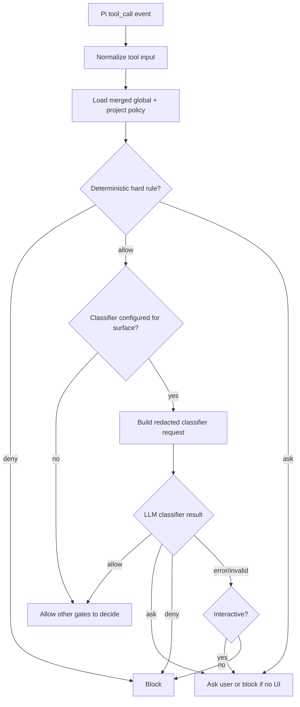

# feat: Add Pi risk classifier permission gate

## Overview

Build `pi-risk-classifier` as a Pi extension that layers an LLM-assisted risk decision over deterministic permission rules. The classifier fills the gray zone between `allow`, `ask`, and `deny` without modifying `@gotgenes/pi-permission-system` internals. It should be configurable globally and per project, fail closed, and produce explainable decisions that can be audited.

The extension is not a sandbox. It is a policy gate that intercepts Pi `tool_call` events, classifies selected operations, and either allows the call to continue, blocks it, or asks the user for confirmation.

---

## Problem Frame

Pi supports extension-level tool interception but does not include built-in command permission JSONs. `@gotgenes/pi-permission-system` provides a widely used deterministic permission layer with `allow`, `ask`, and `deny` surfaces over tools, bash, paths, MCP, skills, and external directories. Some operations are not obviously safe or dangerous from pattern matching alone. A custom `maybe`-style decision can reduce prompt fatigue while keeping suspicious operations gated.

The main design tension is project configurability:

- Some operations are globally dangerous regardless of project, such as secret reads, destructive filesystem operations, or credential exfiltration patterns.
- Some operations are project-dependent, such as publishing, deployment, database commands, generated-file writes, or monorepo-specific external directory access.
- Project-local policy can be useful, but it must not silently weaken global safety floors.

---

## Requirements Trace

- R1. Provide an LLM classifier decision for operations selected by configuration.
- R2. Support global user configuration and project-local configuration.
- R3. Prevent project-local configuration from relaxing globally dangerous denials unless explicitly allowed by a user-owned setting.
- R4. Work alongside `@gotgenes/pi-permission-system` without monkey-patching or relying on private internals.
- R5. Fail closed when the classifier, model provider, parser, or extension policy loading fails.
- R6. Avoid sending secret contents to the classifier.
- R7. Produce human-readable and machine-readable audit records for classifier decisions.
- R8. Keep deterministic rules as the first line of defense; use LLM classification only for configured gray zones.
- R9. Support later migration toward an upstream resolver API if `@gotgenes/pi-permission-system` adds custom permission states.

---

## Scope Boundaries

- The extension will not add a fourth state to `@gotgenes/pi-permission-system` config in v1.
- The extension will not bypass or force-allow denials from `@gotgenes/pi-permission-system`.
- The extension will not read `.env` files, credential files, SSH keys, or file contents for classification.
- The extension will not sandbox process, filesystem, or network access.
- The extension will not replace Docker, Gondolin, OpenShell, or OS-level isolation for untrusted repositories.

### Deferred to Follow-Up Work

- Upstream resolver API proposal for `@gotgenes/pi-permission-system`: separate PR or issue after the layered extension proves useful.
- Rich TUI review surface for classifier reasoning: future iteration after audit log format stabilizes.
- Team-shared policy distribution: future package or dotfiles workflow once local policy semantics are validated.

---

## Context & Research

### Relevant Code and Patterns

- `dot-pi/agent/settings.json` manages Pi packages through the repo-managed Stow path.
- `dot-config/opencode/opencode.json` contains the current OpenCode permission policy to port later.
- `dot-config/opencode/AGENTS.md` and `dot-pi/agent/AGENTS.md` both define global safety expectations, including not reading `.env` or secret-bearing files.
- Pi extension docs describe `tool_call` hooks as blockable and mutable before tool execution.
- Pi examples include `permission-gate.ts` and `protected-paths.ts` for simple interception patterns.

### External References

- `@gotgenes/pi-permission-system` exposes a cross-extension service for policy queries, tool input formatters, and path access extractors, but not custom permission state resolvers.
- `@gotgenes/pi-permission-system` supports global config, project config, per-agent frontmatter, path gates, external directory gates, and fail-closed behavior for bash parsing.
- Pi security docs state Pi has no built-in sandbox and extensions run with the local user's permissions.

---

## Key Technical Decisions

- Build as a separate Pi extension: avoids private internals and lets the deterministic permission system remain authoritative.
- Treat classifier decisions as an additional restrictive gate: the classifier can block or ask, but it should not override a deterministic deny from another permission layer.
- Use deterministic prefilters before LLM classification: obvious dangerous operations should never depend on model judgment.
- Use global safety floors plus project-local extensions: project config can add stricter or context-specific classifier behavior, but cannot weaken global `deny` or `ask` floors by default.
- Default unresolved or failed classification to `ask` in interactive sessions and `deny` in non-interactive sessions.
- Classify metadata only: tool name, command string, path names, normalized cwd relationship, diff-size summaries, operation summaries, and configured project labels; never raw secret file contents.

---

## Open Questions

### Resolved During Planning

- Should `maybe` be implemented inside `@gotgenes/pi-permission-system` v1 config? No. Current public APIs do not support custom states; layering avoids dark magic.
- Should project policy override user policy? Not by default. Project policy should extend and tighten user policy. User config can opt into specific project-owned relaxations if desired.

### Deferred to Implementation

- Exact model provider and model default: depends on Pi's active model APIs and desired cost/latency tradeoff.
- Exact policy file names: proposed below, but implementation should verify Pi package conventions before finalizing.
- Whether classifier prompts should use Pi's current model or a separate configured model: decide after verifying extension model-call APIs.

---

## Output Structure

    dot-pi/agent/extensions/pi-risk-classifier/
      index.ts
      config.schema.json
      README.md
      prompts/
        classifier.md
      src/
        config.ts
        policy-merge.ts
        deterministic-prefilter.ts
        tool-normalizer.ts
        classifier-client.ts
        decision-cache.ts
        audit-log.ts
        types.ts
      test/
        policy-merge.test.ts
        deterministic-prefilter.test.ts
        tool-normalizer.test.ts
        classifier-decision.test.ts

---

## High-Level Technical Design

> *This illustrates the intended approach and is directional guidance for review, not implementation specification. The implementing agent should treat it as context, not code to reproduce.*

Decision flow:



Policy layering model:

```text
user hard floors       -> cannot be weakened by project config
user classifier policy -> default gray-zone behavior
project policy         -> can tighten, add project context, or mark project-specific risks
session approvals      -> optional in-memory allow/deny cache for repeated identical classifier prompts
```

---

## Implementation Units

- [ ] U1. **Define policy format and merge semantics**

**Goal:** Specify the global and project configuration model, including how project policy extends user policy without weakening global safety floors.

**Requirements:** R2, R3, R8

**Dependencies:** None

**Files:**
- Create: `dot-pi/agent/extensions/pi-risk-classifier/config.schema.json`
- Create: `dot-pi/agent/extensions/pi-risk-classifier/src/types.ts`
- Create: `dot-pi/agent/extensions/pi-risk-classifier/src/config.ts`
- Create: `dot-pi/agent/extensions/pi-risk-classifier/src/policy-merge.ts`
- Test: `dot-pi/agent/extensions/pi-risk-classifier/test/policy-merge.test.ts`

**Approach:**
- Use a user-owned global config as the safety floor.
- Use project config as an additive/tightening layer by default.
- Represent each rule with an action such as `classify`, `ask`, `deny`, or `allow`, while making `allow` unable to override global `deny` or global `ask` unless a user-owned `allowProjectRelaxations` setting explicitly names the project path or policy id.
- Include project context fields such as `riskProfile`, `deploymentTargets`, `sensitivePaths`, and `dangerousCommands` so the classifier can understand project-specific danger without reading repository secrets.
- Keep rule order deterministic and documented.

**Technical design:**

```text
Effective decision = most restrictive of:
  global hard floor
  global classifier rule
  project hardening rule
  session cache decision

Restrictiveness: deny > ask > classify > allow
Project config can move right-to-left only by default.
```

**Patterns to follow:**
- Pi package config patterns in `dot-pi/agent/settings.json`.
- `@gotgenes/pi-permission-system` separation between global and project config, but with stricter default project relaxation semantics for this classifier.

**Test scenarios:**
- Happy path: global `bash.* = classify` plus project `bash.deploy * = ask` resolves deploy commands to `ask`.
- Edge case: project `allow` for a command globally marked `deny` remains `deny`.
- Edge case: project `deny` for a globally allowed command resolves to `deny`.
- Error path: malformed project config is ignored or fails closed according to configured mode, with a warning and audit entry.
- Error path: malformed global config disables classifier and blocks classified surfaces in non-interactive mode.

**Verification:**
- Policy merge behavior is deterministic, documented, and covered by tests before tool interception is wired.

---

- [ ] U2. **Implement tool normalization and redaction**

**Goal:** Convert Pi tool calls into classifier-safe summaries without exposing secret contents.

**Requirements:** R1, R6, R7

**Dependencies:** U1

**Files:**
- Create: `dot-pi/agent/extensions/pi-risk-classifier/src/tool-normalizer.ts`
- Test: `dot-pi/agent/extensions/pi-risk-classifier/test/tool-normalizer.test.ts`

**Approach:**
- Normalize built-in tools: `bash`, `read`, `write`, `edit`, `grep`, `find`, and `ls`.
- Extract path names, command strings, operation type, cwd relationship, and rough change size.
- Redact likely credentials from command strings and tool arguments before classifier calls and audit logs.
- For `write` and `edit`, summarize content length, line counts, target path, and whether content resembles a secret assignment; do not send raw content by default.
- For `bash`, parse enough shell structure to identify pipes, redirects, network calls, package publishes, destructive commands, and file targets when feasible.

**Patterns to follow:**
- Existing repo rule: never read `.env` or files containing secrets.
- `@gotgenes/pi-permission-system` prompt-preview principle: concise summaries instead of raw multiline JSON.

**Test scenarios:**
- Happy path: `bash` command `git status --short` normalizes to a low-risk git read summary.
- Happy path: `edit` against `README.md` produces path and line-count summary without raw replacement text.
- Edge case: command containing `TOKEN=abc123` redacts the value before classification and logging.
- Edge case: `read .env` normalizes path metadata only and does not read file content.
- Error path: malformed tool input produces a safe `unknown` summary and forces `ask` or `deny` according to runtime mode.

**Verification:**
- No classifier request includes raw file contents for write/edit/read operations unless an explicit future setting enables safe snippets.

---

- [ ] U3. **Add deterministic prefilter**

**Goal:** Catch clearly safe and clearly dangerous operations before invoking the LLM classifier.

**Requirements:** R5, R6, R8

**Dependencies:** U1, U2

**Files:**
- Create: `dot-pi/agent/extensions/pi-risk-classifier/src/deterministic-prefilter.ts`
- Test: `dot-pi/agent/extensions/pi-risk-classifier/test/deterministic-prefilter.test.ts`

**Approach:**
- Hard-deny secret paths and credential exfiltration patterns.
- Hard-ask or hard-deny destructive commands depending on policy: `rm -rf`, `git reset`, `git clean`, force pushes, publish commands, cloud mutations, terraform mutations, and pipe-to-shell downloads.
- Allow configured low-risk read-only commands without classifier cost when policy permits.
- Make prefilter outcomes auditable with matched rule and rationale.

**Patterns to follow:**
- Current OpenCode policy in `dot-config/opencode/opencode.json` for git, package publish, docker read-only, gcloud read-only, and terraform read-only distinctions.

**Test scenarios:**
- Happy path: `git status` resolves allow when configured as safe.
- Happy path: `pnpm publish` resolves deny regardless of classifier availability.
- Edge case: `curl https://example/install.sh | bash` resolves deny or ask by deterministic rule.
- Error path: unknown shell wrapper such as `bash -c '<opaque>'` resolves ask in interactive mode and deny in non-interactive mode.

**Verification:**
- LLM classification is never needed for the highest-risk obvious patterns.

---

- [ ] U4. **Implement classifier client and prompt contract**

**Goal:** Add the LLM-backed decision path with structured output and strict failure handling.

**Requirements:** R1, R5, R6, R7

**Dependencies:** U1, U2, U3

**Files:**
- Create: `dot-pi/agent/extensions/pi-risk-classifier/src/classifier-client.ts`
- Create: `dot-pi/agent/extensions/pi-risk-classifier/prompts/classifier.md`
- Test: `dot-pi/agent/extensions/pi-risk-classifier/test/classifier-decision.test.ts`

**Approach:**
- Use a structured response shape: `decision`, `risk`, `reason`, `confidence`, and optional `suggestedPrompt`.
- Limit classifier inputs to normalized summaries, policy context, project risk context, and user request context if safely available.
- Treat invalid JSON, low confidence, timeout, provider error, or missing model as `ask` with UI and `deny` without UI.
- Cache identical normalized requests within a session to reduce repeated calls.

**Technical design:**

```json
{
  "decision": "allow | ask | deny",
  "risk": "low | medium | high",
  "confidence": 0.0,
  "reason": "short explanation",
  "suggestedPrompt": "optional user-facing ask message"
}
```

**Patterns to follow:**
- Pi extension docs for abort-aware async work using `ctx.signal`.
- Existing prompt-writing standards in `dot-pi/agent/skills/prompting/SKILL.md` if prompt text needs refinement during implementation.

**Test scenarios:**
- Happy path: low-risk read-only command returns `allow` and continues.
- Happy path: ambiguous deployment command returns `ask` with a concise reason.
- Error path: invalid classifier JSON resolves to ask/deny according to UI availability.
- Error path: classifier timeout resolves to ask/deny and writes an audit entry.
- Edge case: low-confidence `allow` is downgraded to `ask` by policy threshold.

**Verification:**
- Classifier output cannot silently allow on parse or provider failure.

---

- [ ] U5. **Wire Pi extension tool-call enforcement**

**Goal:** Register the Pi extension and enforce classifier decisions during `tool_call`.

**Requirements:** R1, R4, R5, R7, R9

**Dependencies:** U1, U2, U3, U4

**Files:**
- Create: `dot-pi/agent/extensions/pi-risk-classifier/index.ts`
- Create: `dot-pi/agent/extensions/pi-risk-classifier/src/decision-cache.ts`
- Modify: `dot-pi/agent/settings.json`

**Approach:**
- Hook `pi.on("tool_call")` and evaluate only configured surfaces.
- Return `{ block: true, reason }` for classifier `deny` or no-UI `ask`.
- Use `ctx.ui.confirm` for classifier `ask` in interactive mode.
- Return `undefined` for classifier `allow`, leaving other extensions and tools to continue normally.
- Query `@gotgenes/pi-permission-system` service when installed for contextual policy information, but treat absence as graceful degradation.
- Do not depend on handler ordering for safety; if the deterministic permission system blocks later, that block remains authoritative.

**Patterns to follow:**
- Pi `tool_call` extension examples: `permission-gate.ts` and `protected-paths.ts`.
- `@gotgenes/pi-permission-system` cross-extension API for optional policy queries.

**Test scenarios:**
- Happy path: configured classifier allow lets the tool proceed.
- Happy path: classifier deny blocks with a human-readable reason.
- Happy path: classifier ask prompts in UI and respects user denial.
- Error path: no UI plus classifier ask blocks.
- Integration: when `@gotgenes/pi-permission-system` is installed and has a deterministic deny, this extension does not attempt to override it.

**Verification:**
- Tool-call enforcement works as a restrictive layer and remains safe regardless of extension ordering.

---

- [ ] U6. **Add audit logging and documentation**

**Goal:** Make classifier behavior understandable, reviewable, and maintainable.

**Requirements:** R7, R9

**Dependencies:** U1, U2, U3, U4, U5

**Files:**
- Create: `dot-pi/agent/extensions/pi-risk-classifier/src/audit-log.ts`
- Create: `dot-pi/agent/extensions/pi-risk-classifier/README.md`
- Modify: `docs/plans/2026-07-05-001-feat-pi-risk-classifier-plan.md`

**Approach:**
- Write JSONL audit entries with timestamp, tool, normalized surface, redacted value, decision source, model decision, final outcome, and reason.
- Keep logs out of model context unless explicitly read by the user.
- Document config examples for global floors, project hardening, non-interactive behavior, and recommended pairing with `@gotgenes/pi-permission-system`.
- Document the future path to an upstream resolver API if custom states become supported.

**Test scenarios:**
- Happy path: classifier allow writes a redacted audit entry.
- Happy path: deterministic deny writes matched rule and no classifier payload.
- Edge case: command with token-like value is redacted in logs.
- Error path: audit logging failure does not allow a dangerous tool call; it degrades to ask/deny according to policy.

**Verification:**
- A user can understand why each classified operation was allowed, asked, or denied without exposing secrets in logs.

---

## System-Wide Impact

- **Interaction graph:** Pi `tool_call` events pass through this extension and any other installed permission extensions before tool execution.
- **Error propagation:** Classifier errors become `ask` in interactive mode or `deny` in non-interactive mode.
- **State lifecycle risks:** Session-level cached decisions must be cleared on session shutdown and should not persist across unrelated repositories.
- **API surface parity:** Built-in file tools, bash, MCP proxy tools, and custom extension tools need consistent normalization where possible.
- **Integration coverage:** Tests should cover this extension running both with and without `@gotgenes/pi-permission-system` installed.
- **Unchanged invariants:** Deterministic permission-system denials remain authoritative; project config does not weaken global safety floors by default.

---

## Risks & Dependencies

| Risk | Mitigation |
|------|------------|
| LLM classifier incorrectly allows a dangerous operation | Deterministic hard-deny prefilter, confidence threshold, project hardening rules, and fail-closed behavior |
| Project config weakens global safety | Default merge semantics allow project config to tighten only; user-owned explicit relaxations required for weakening |
| Secret leakage to classifier or logs | Normalize metadata only, redact command strings, never read sensitive file contents |
| Extension ordering creates bypass | Treat classifier as restrictive only; do not rely on force-allow behavior |
| Prompt fatigue shifts from permission-system to classifier asks | Cache identical decisions in-session and tune classifier thresholds after observing audit logs |
| Model/provider outage blocks useful work | In interactive mode degrade to human `ask`; in automation fail closed |

---

## Documentation / Operational Notes

- Document installation as a local/global Pi extension first, not as a shared package.
- Start with conservative policy: deterministic denies for secrets and destructive operations, classifier for unknown bash and path-bearing operations, human ask for ambiguous high-impact commands.
- Recommend pairing with `@gotgenes/pi-permission-system` for deterministic path and bash floors.
- Keep project-local config in `.pi/extensions/pi-risk-classifier/config.json` or a similarly scoped path so repositories can express project-specific danger without modifying user-owned global safety floors.

---

## Sources & References

- Related config: `dot-config/opencode/opencode.json`
- Related config: `dot-pi/agent/settings.json`
- Related policy instructions: `dot-pi/agent/AGENTS.md`
- Pi docs: `docs/security.md`, `docs/extensions.md`, `docs/containerization.md` from the installed Pi documentation
- Package docs: `@gotgenes/pi-permission-system` README and cross-extension API
